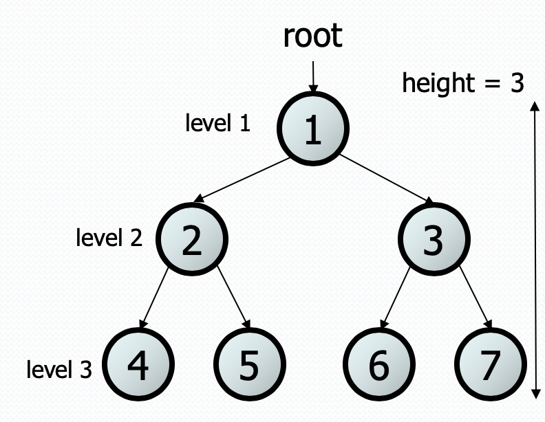

# Binary Tree
This project contains binary tree where you can:
- Add nodes
- Delete nodes
- Search for a node

The are also three implemented ways of printing the tree in the console:
- Straight
- Symmetrical
- Reverse

Given our tree looks like this

- Straight would print `1 2 4 5 3 6 7`
- Symmetrical would print `4 2 5 1 6 3 7`
- Reverse would print `4 5 2 6 7 3 1`